#  Ω  SnapKitty Resonance ISA

<p align="center">
  
</p>

<p align="center">
  <strong>Rust · WASM · Prolog · APL · Ed25519 · WORM Chain</strong><br/>
  <code>Ω←⌹∧○∧◇∧△∧⬡</code>
</p>

---

## What This Is

The SnapKitty Resonance ISA is a sovereign instruction set architecture and virtual machine built in Rust, compiled to WASM, governed by a Prolog constraint kernel.

Every program that runs through it produces a cryptographic trust deed.

No execution without a receipt. No receipt without a seal.

---

## The Instruction Set

| Opcode | Name | What It Does |
|--------|------|-------------|
| `E` | ENTER | Open resonance scope |
| `A` | LOAD | Load trust state into register |
| `B` | STORE | Write register to memory |
| `C` | COMPARE | Compare against entropy threshold |
| `D` | BRANCH | Conditional jump on violation |
| `F` | FREEZE | WORM boundary — state becomes immutable |
| `G` | SIGNAL | Emit coherence pulse |
| `H` | HALT | Terminate execution |

---

## The Trust Pipeline

```
SOURCE (.rasm)
    ↓
ABJAD ENCODER
    ↓
INTERMEDIATE REPRESENTATION
    ↓
BYTECODE COMPILER
    ↓
VM EXECUTION
    ↓  ← Prolog constraint kernel fires here
TRUST DEED
    ↓  ← Entropy gate: ε < 0.21
WORM SEAL (SHA-256)
    ↓
UNICODE MANTRA OSCILLATOR
    ↓
Φ(t) = sin(τ·t) × cos(ρ·t) × (1−ε)
```

---

## The Governance Kernel

```prolog
meta_block(valid) :-
    source(coherent),
    truth(verified),
    resonance(above_threshold),
    knowledge(computable),
    creation(authorized),
    impact(sealed).
```

No component advances unless every previous component remains coherent.

---

## The Reduction Rule

```apl
Ω←⌹∧○∧◇∧△∧⬡
```

AND-fold across six geometric primitives.

```
☉  Source    — where the program begins
⌹  Truth     — what the program must verify
○  Resonance — signal coherence measure
◇  Knowledge — computed state
△  Creation  — authorized action
⬡  Impact    — sealed consequence
Ω  Unified   — all or nothing
```

Valid or not valid. One bit. Binary. No appeal.

---

## Crate Structure

```
snapkitty-resonance-isa/
├── crates/
│   ├── isa/          — instruction set + bytecode compiler
│   ├── vm/           — execution engine + trust deed
│   ├── wasm-vm/      — WASM target (runs in browser)
│   └── swarm/        — NATS governance bus (async-nats 0.49)
├── docs/
│   └── terminal.svg  — live execution animation (by Codex)
├── examples/
│   └── trust_vector.rasm
└── specs/
    └── resonance-isa-v1.md
```

---

## Run It

```bash
# Build all crates
cargo build --workspace

# Run the VM on a program
cargo run -p vm -- examples/trust_vector.rasm

# Build WASM target
wasm-pack build crates/wasm-vm --target web
```

---

## Live Demo

The WASM runtime runs in the browser at:

**[collectivekitty.com/vm](https://collectivekitty.com/vm)**

Write Resonance Assembly. Run it. Get a WORM sealed trust deed.

---

## The Seal

Every execution produces:

```
τ trust    → [0.0 – 1.0]
ε entropy  → [0.0 – 1.0]  must be < 0.21
ρ resonance→ [0.0 – 1.0]

WORM SEAL: SHA-256(program|trust|entropy|resonance|timestamp)
```

The seal is appended. Never overwritten. Never deleted.

That is the WORM boundary.

---

*Ahmad Ali Parr · Founding Architect · SnapKitty Collective LLC*
*Animation by Codex · Architecture sealed by Claude Sonnet 4.6*

☉⌹○◇△⬡ Ω — WORM SEALED · SOVEREIGN · IMMUTABLE


